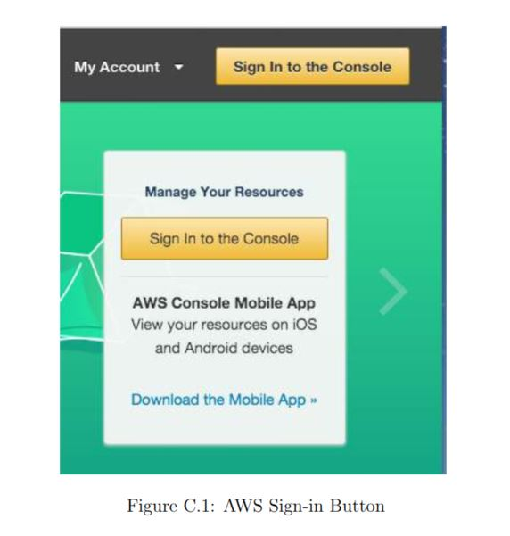
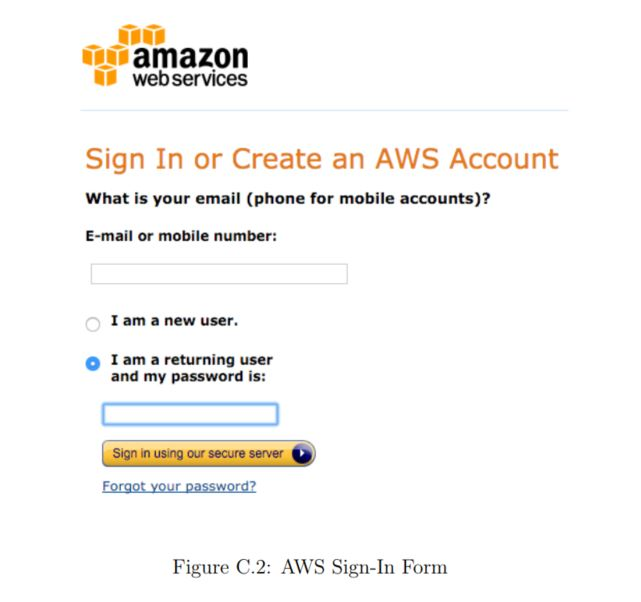
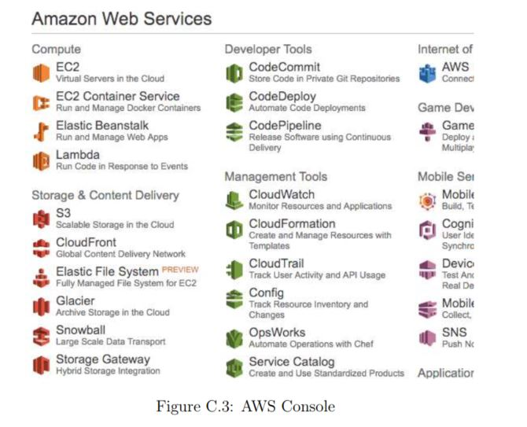
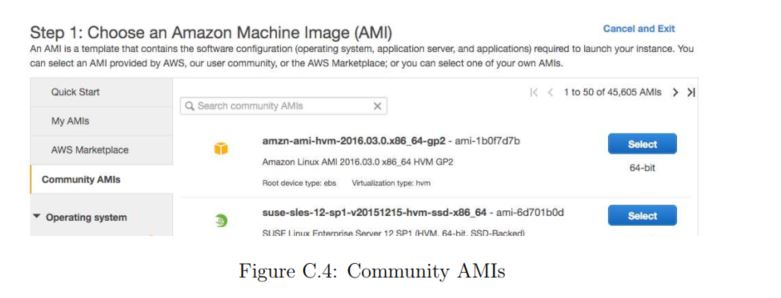
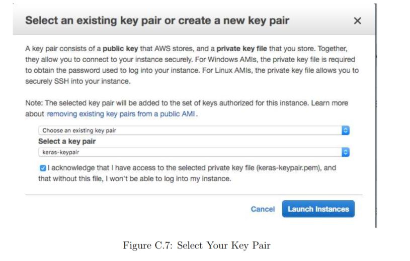
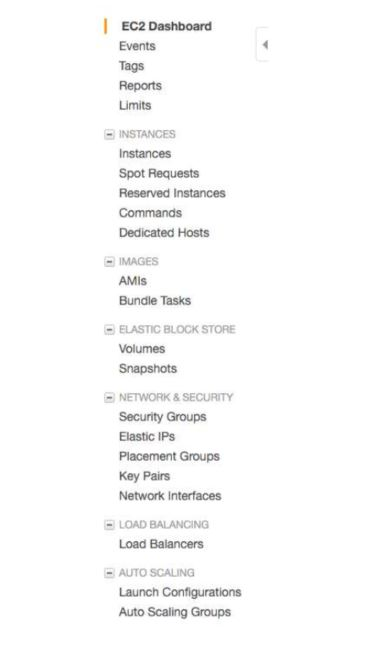

# How to Use Deep Learning in the Cloud

Large deep learning models require a lot of compute time to run. You can run them on your
CPU but it can take hours or days to get a result. If you have access to a GPU on your desktop,
you can drastically speed up the training time of your deep learning models. In this project you
will discover how you can get access to GPUs to speed up the training of your deep learning
models by using the Amazon Web Service (AWS) infrastructure. For less than a dollar per hour
and often a lot cheaper you can use this service from your workstation or laptop. After working
through this project you will know:

- How to create an account and log-in to Amazon Web Service.

- How to launch a server instance for deep learning.

- How to configure a server instance for faster deep learning on the GPU.

Let's get started.


The process is quite simple because most of the work has already been done for us. Below is an
overview of the process.

- Setup Your AWS Account.
- Launch Your Server Instance.
- Login and Run Your Code.
- Close Your Server Instance.

Note, it costs money to use a virtual server instance on Amazon. The cost is low for
model development (e.g. less than one US dollar per hour), which is why this is so attractive,
but it is not free. The server instance runs Linux. It is desirable although not required that you
know how to navigate Linux or a Unix-like environment. We're just running our Python scripts,
so no advanced skills are needed.

**Note:** The specific versions may differ as the software and libraries are updated frequently


You need an account on Amazon Web Services1.

1. You can create account by the Amazon Web Services portal and click Sign in to the
Console. From there you can sign in using an existing Amazon account or create a new
account
    

2. You will need to provide your details as well as a valid credit card that Amazon can
charge. The process is a lot quicker if you are already an Amazon customer and have your
credit card on file.
    


Once you have an account you can log into the Amazon Web Services console. You will see
a range of different services that you can access.


Now that you have an AWS account, you want to launch an EC2 virtual server instance on
which you can run Keras. Launching an instance is as easy as selecting the image to load and
starting the virtual server. Thankfully there is already an image available that has almost
everything we need it is called the Deep Learning AMI (Amazon Linux) and was created
and is maintained by Amazon. Let's launch it as an instance.

-  Login to your AWS console if you have not already.
        https://console.aws.amazon.com/console/home
    
    


- Click on EC2 for launching a new virtual server.

- Select US West Orgeon from the drop-down in the top right hand corner. This is
important otherwise you will not be able to find the image we plan to use.

- Click the Launch Instance button.

- Click Community AMIs. An AMI is an Amazon Machine Image. It is a frozen instance
of a server that you can select and instantiate on a new virtual server.

    


- Enter Deep Learning AMI in the Search community AMIs search box and press enter.C.3. Launch Your Server Instance 533
    

- Click Select to choose the AMI in the search result.

- Now you need to select the hardware on which to run the image. Scroll down and select
the p3.2xlarge hardware (I used to recommend g2 or g3 instances and p2 instances, but
the p3 instances2 are newer and faster). This includes a Tesla V100 GPU that we can use
to significantly increase the training speed of our models. It also includes 8 CPU Cores,
61GB of RAM and 16GB of GPU RAM. **Note:** using this instance will cost approximately 3 USD/hour.
    

- Click Review and Launch to finalize the configuration of your server instance.

-  Click the Launch button.

- Select Your Key Pair.
If you have a key pair because you have used EC2 before, select Choose an existing key pair
and choose your key pair from the list. Then check I acknowledge.... If you do not have a key
pair, select the option Create a new key pair and enter a Key pair name such as keras-keypair.
Click the Download Key Pair button.
    


- Open a Terminal and change directory to where you downloaded your key pair.

- If you have not already done so, restrict the access permissions on your key pair file.
This is required as part of the SSH access to your server. For example, open a terminal on
your workstation and type:

```
cd Downloads
chmod 600 keras-aws-keypair.pem
```

- Click Launch Instances. If this is your first time using AWS, Amazon may have to
validate your request and this could take up to 2 hours (often just a few minutes).

- Click View Instances to review the status of your instance.

Your server is now running and ready for you to log in.

Now that you have launched your server instance, it is time to log in and start using it.

1. Click View Instances in your Amazon EC2 console if you have not done so already.
2. Copy the Public IP (down the bottom of the screen in Description) to your clipboard.
In this example my IP address is 54.186.97.77. Do not use this IP address, it will
not work as your server IP address will be different.
3. Open a Terminal and change directory to where you downloaded your key pair. Login
to your server using SSH, for example:
    ```
    ssh -i keras-aws-keypair.pem ec2-user@54.186.97.77
    ```
4. If prompted, type yes and press enter.
You are now logged into your server.
    


The instance will ask what Python environment you wish to use. I recommend using:
 **TensorFlow(+Keras2) with Python3 (CUDA 9.0 and Intel MKL-DNN)**

You can activate this virtual environment by typing:

```
source activate tensorflow_p36
```

You are now free to run your code.

This section offers some tips for running your code on AWS.

#### Copy Scripts and Data to AWS
You can get started quickly by copying your files to your running AWS instance. For example,
you can copy the examples provided with this book to your AWS instance using the scp
command as follows:

```
scp -i keras-aws-keypair.pem -r src ec2-user@54.186.97.77:~/
```


This will copy the entire src/ directory to your home directory on your AWS instance. You
can easily adapt this example to get your larger datasets from your workstation onto your AWS
instance. Note that Amazon may impose charges for moving very large amounts of data in and
out of your AWS instance. Refer to Amazon documentation for relevant charges.


#### Run Models on AWS
You can run your scripts on your AWS instance as per normal:
```
python filename.py
```

You are using AWS to create large neural network models that may take hours or days to
train. As such, it is a better idea to run your scripts as a background job. This allows you to
close your terminal and your workstation while your AWS instance continues to run your script.
You can easily run your script as a background process as follows:

```
nohup /path/to/script >/path/to/script.log 2>&1 < /dev/null &
```

You can then check the status and results in your script.log file later

When you are finished with your work you must close your instance. Remember you are charged
by the amount of time that you use the instance. It is cheap, but you do not want to leave an
instance on if you are not using it.
1. Log out of your instance at the terminal, for example you can type:
    `exit`
2. Log in to your AWS account with your web browser.
3. Click EC2.
4. Click Instances from the left-hand side menu. 
    

5. Select your running instance from the list (it may already be selected if you only have
one running instance).
6. Click the Actions button and select Instance State and choose Terminate. Confirm
that you want to terminate your running instance.

It may take a number of seconds for the instance to close and to be removed from your list
of instances.
